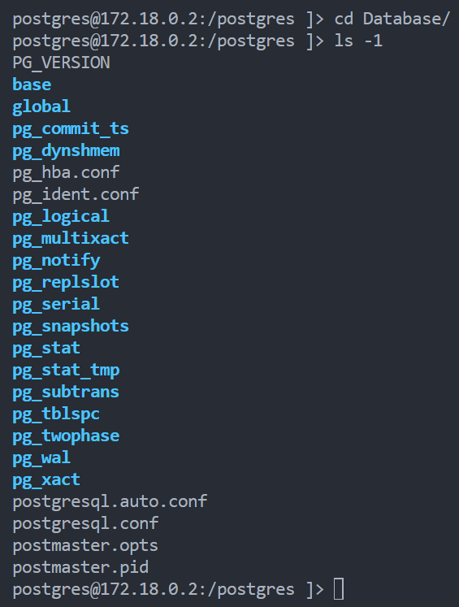
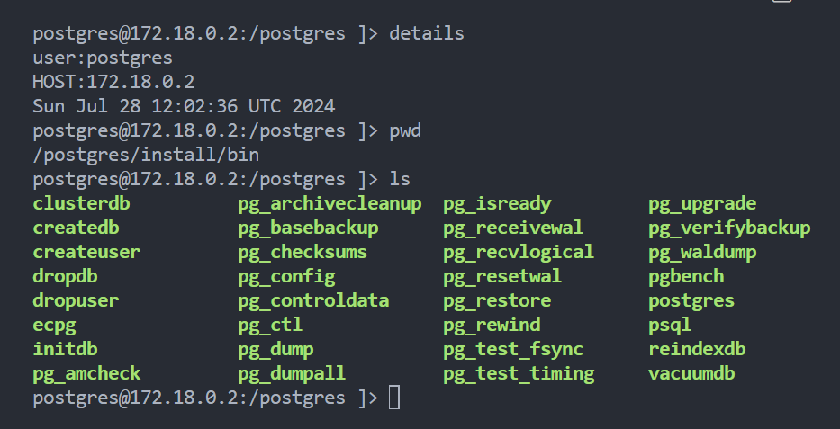

# Chapter 2: Exploring DB

---


---

> [!NOTE]
>
> Topics to be covered :
>
> 1. [Version of server](#version-of-server)
> 1. [Checking Server Uptime](#checking-server-uptime)
> 1. [DB Server file structure](#db-server-file-structure)
> 1. [Envvar setting process](#envvar-setting-process)
> 1. [DB system identifier](#db-system-identifier)
> 1. Locating Databases in DB Server
> 1. Listing DBs
> 1. Listing How many tables are there
> 1. Checking Disk Space usage by a table
> 1. Which are the biggest tables
> 1. Listing How many rows are there in a table
> 1. Quickly estimating the no of rows in a table
> 1. Extensions in DB
> 1. **Check Object Dependency**

---

## Version of server

> [!TIP]
>
> ```sql
> select version();
> ```
>
> Output:
>
> ```bash
> postgres=# select version();
>                                                   version       ion
> ------------------------------------------------------------------------------------------------------------------------
>                                                       cc (Alpine
> PostgreSQL 16.3 on x86_64-pc-linux-musl, compiled by gcc (Alpine 13.2.1_git20240309) 13.2.1 20240309, 64-bit
> (1 row)
> ```
>
> Another way:
>
> ```bash
> cat $PGDATA/PG_VERSION
> ```
>
> ```bash
> psql --version
> ```

## Checking **Server Uptime**

> [!IMPORTANT]
> To check the up time of the server we can use below query
>
> ```sql
> select date_trunc('second', current_timestamp - pg_postmaster_start_time()) as uptime;
> ```
>
> output:
>
> ```bash
>  uptime
> ----------
> 00:57:14
> (1 row)
> ```

## DB Server file structure

>[!IMPORTANT]
> the folder structure inside `$PGDATA` dir
>

| Subdirectory Under $PGDATA | Purpose                                                                           |
| -------------------------- | --------------------------------------------------------------------------------- |
| base                       | this is main table storage, beneath this directory, each db has its own directory |
| global                     | tables are stored here which are shared across all Databases                      |
| pg_commit_ts               | transasction commit timstamp data                                                 |
| pg_clog                    | transaction status file                                                           |
| pg_multixact               | row level locks                                                                   |
| pg_snapshot                | to store exported snapshot                                                        |
| pg_stat                    | permanent statistics data                                                         |
| pg_stat_tmp                | transient stat data                                                               |
| pg_subtrans                | \-                                                                                |
| pg_tblspc                  | symbolic links to tablespace directories                                          |
| pg_xlog                    | WAL (write ahead log) or transactions logs                                        |
| pg_notify                  | listen / notify status file                                                       |

>[!IMPORTANT]
> the folder structure inside Postgres installation path
>
>

## Envvar setting process

> [!TIP]
>```bash
> PGROOT=/home/postgres
> PGREALESE=16.3
> PGSERVERNAME=PGDB1
> PGDATA=$PGROOT/$PGREALESE/$PGSERVERNAME
>```


## DB system identifier

> [!TIP]
>
>Each Database has a system identifier assigned When the database is initialized. The server identifier remains the same if the server is backed up cloned and so on.
>
>Many actions on the server are keyed to the system identifier, and you may be asked to provide this information when you report a fault.
>
>```bash
> pg_controldata $PGDATA | grep -i "system.*.identifier"
> ```
>
> Output:
>```bash
>Database system identifier:           7388225005664768010
>```

