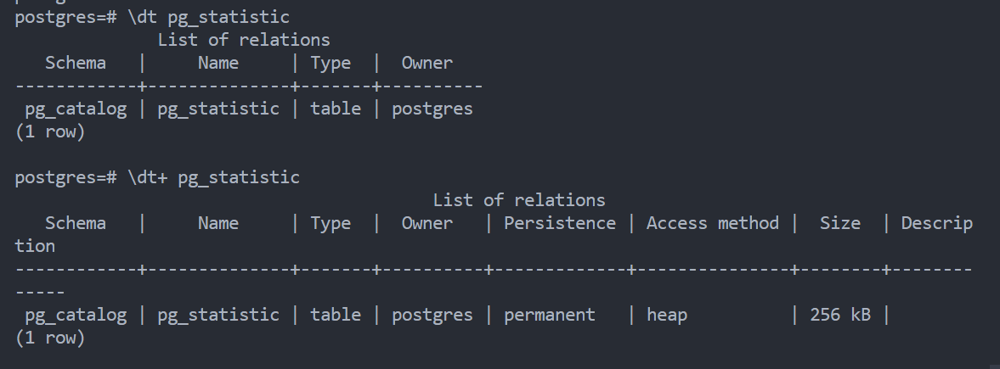

# Chapter 2: Exploring DB

---


---

<!-- > 1. Locating Databases in DB Server -->

## Topics to be covered

> [!NOTE]
>
> 1. [Version of server](#version-of-server)
> 1. [Checking Server Uptime](#checking-server-uptime)
> 1. [DB Server file structure](#db-server-file-structure)
> 1. [Envvar setting process](#envvar-setting-process)
> 1. [DB system identifier](#db-system-identifier)
> 1. [Listing DBs](#listing-dbs)
> 1. [Listing How many tables are there](#listing-how-many-tables-are-there)
> 1. [Disk Space usage by Current Database](#disk-space-usage-by-current-database)
> 1. [Checking Disk Space usage by a table](#checking-disk-space-usage-by-a-table)
> 1. [Which are the biggest tables](#which-are-the-biggest-tables)
> 1. Listing How many rows are there in a table
> 1. Quickly estimating the no of rows in a table
> 1. Extensions in DB
> 1. **Check Object Dependency**

---

## Version of server

> [!TIP]
>
> ```sql
> select version();
> ```
>
> Output:
>
> ```bash
> postgres=# select version();
>                                                   version       ion
> ------------------------------------------------------------------------------------------------------------------------
>                                                       cc (Alpine
> PostgreSQL 16.3 on x86_64-pc-linux-musl, compiled by gcc (Alpine 13.2.1_git20240309) 13.2.1 20240309, 64-bit
> (1 row)
> ```
>
> Another way:
>
> ```bash
> cat $PGDATA/PG_VERSION
> ```
>
> ```bash
> psql --version
> ```

## Checking Server Uptime

> [!IMPORTANT]
> To check the up time of the server we can use below query
>
> ```sql
> select date_trunc('second', current_timestamp - pg_postmaster_start_time()) as uptime;
> ```
>
> output:
>
> ```bash
>  uptime
> ----------
> 00:57:14
> (1 row)
> ```

## DB Server file structure

> [!IMPORTANT]
> the folder structure inside `$PGDATA` dir
> 

| Subdirectory Under $PGDATA | Purpose                                                                           |
| -------------------------- | --------------------------------------------------------------------------------- |
| base                       | this is main table storage, beneath this directory, each db has its own directory |
| global                     | tables are stored here which are shared across all Databases                      |
| pg_commit_ts               | transasction commit timstamp data                                                 |
| pg_clog                    | transaction status file                                                           |
| pg_multixact               | row level locks                                                                   |
| pg_snapshot                | to store exported snapshot                                                        |
| pg_stat                    | permanent statistics data                                                         |
| pg_stat_tmp                | transient stat data                                                               |
| pg_subtrans                | \-                                                                                |
| pg_tblspc                  | symbolic links to tablespace directories                                          |
| pg_xlog                    | WAL (write ahead log) or transactions logs                                        |
| pg_notify                  | listen / notify status file                                                       |

> [!IMPORTANT]
> the folder structure inside Postgres installation path
>
> 

## Envvar setting process

> [!TIP]
>
> ```bash
> PGROOT=/home/postgres
> PGREALESE=16.3
> PGSERVERNAME=PGDB1
> PGDATA=$PGROOT/$PGREALESE/$PGSERVERNAME
> ```

## DB system identifier

> [!TIP]
>
> Each Database has a system identifier assigned When the database is initialized. The server identifier remains the same if the server is backed up cloned and so on.
>
> Many actions on the server are keyed to the system identifier, and you may be asked to provide this information when you report a fault.
>
> ```bash
> pg_controldata $PGDATA | grep -i "system.*.identifier"
> ```
>
> Output:
>
> ```bash
> Database system identifier:           7388225005664768010
> ```

## Listing DBs

> [!IMPORTANT]
>
> ```sql
> select datname from pg_database;
> ```
>
> ```sql
> select * from pg_database;
> ```
>
> OR
>
> ```bash
> psql -c "\l"
> ```

## Listing How many tables are there

> [!TIP]
>
> `postgres=# `
>
> ```sql
> select count(*) from information_schema.tables;
> ```
>
> Output:
>
> ```bash
> count
> -------
>   209
> (1 row)
> ```

## Disk Space usage by Current Database

> [!TIP]
>
> ```sql
> select pg_database_size(current_database())/(1024^2)  "size in MB";
> ```

> [!TIP]
>
> ```sql
> select pg_size_pretty(pg_database_size(current_database()));
> ```

> Output:
>
> ```bash
> pg_size_pretty
> ----------------
> 7252 kB
> (1 row)
> ```

## Checking Disk Space usage by a table

> [!TIP]
>
> size of table only
>
> ```sql
> select pg_relation_size('table_name');
> ```
>
> size of table with index and other related space
>
> ```sql
> select pg_total_relation_size('table_name');
> ```

OR

> [!TIP]
>
> size of table only
>
> ```sql
> \dt+ table_name
> ```
>
> Output
> 

## Which are the biggest tables

> [!TIP]
>
> ```sql
> select table_name,pg_size_pretty(pg_relation_size(table_schema || '.' || table_name)) as Size FROM information_schema.tables order by size desc
> ```

[Topics to be covered](#topics-to-be-covered)
